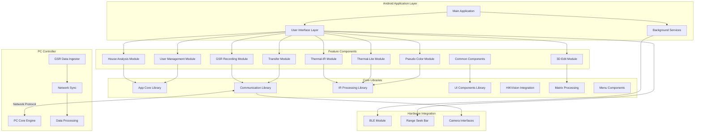
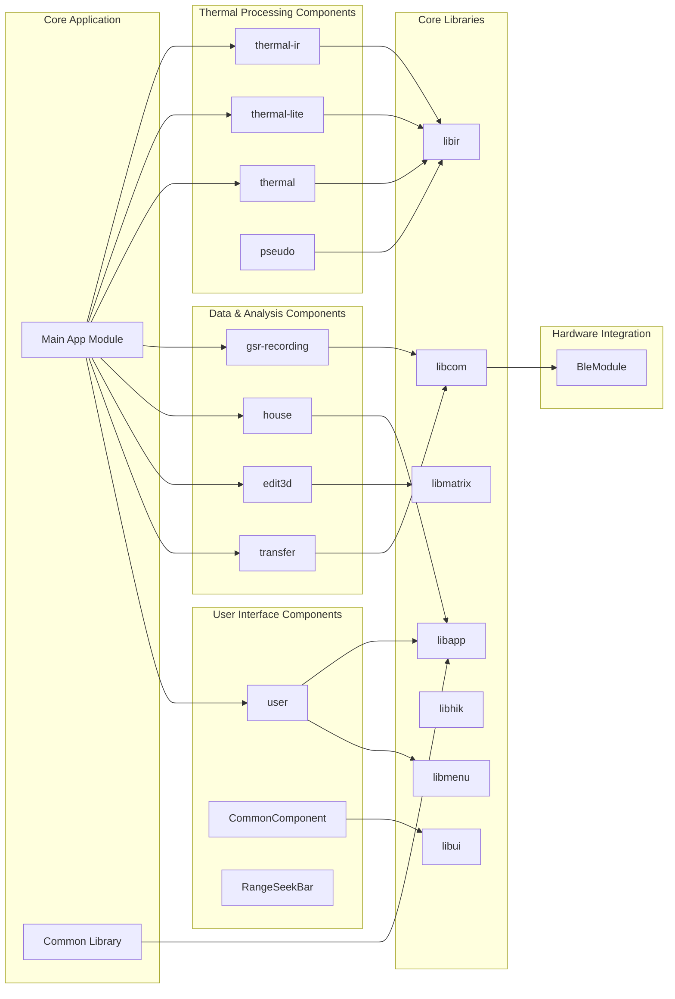
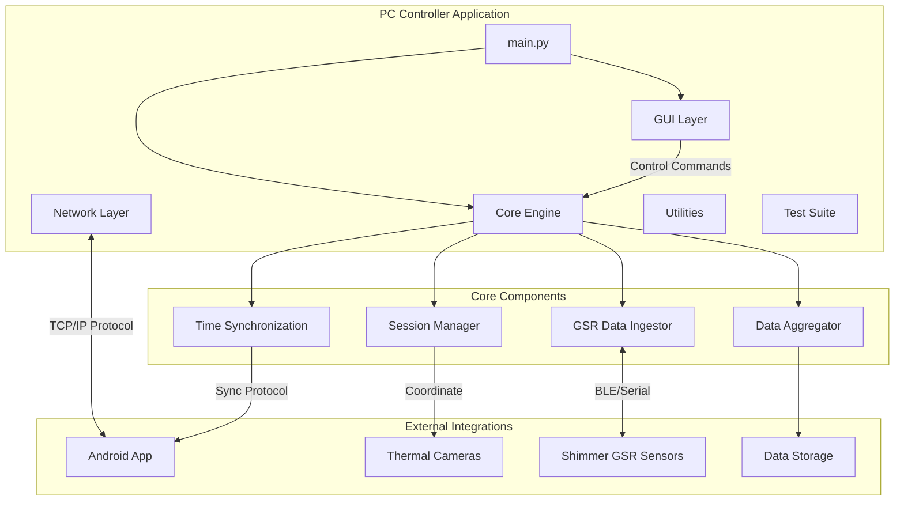
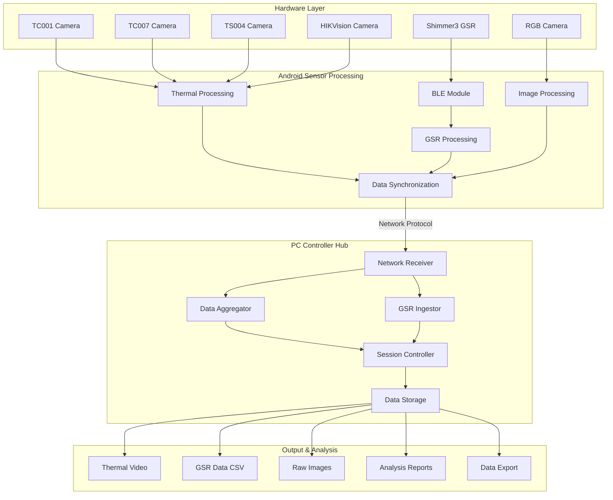
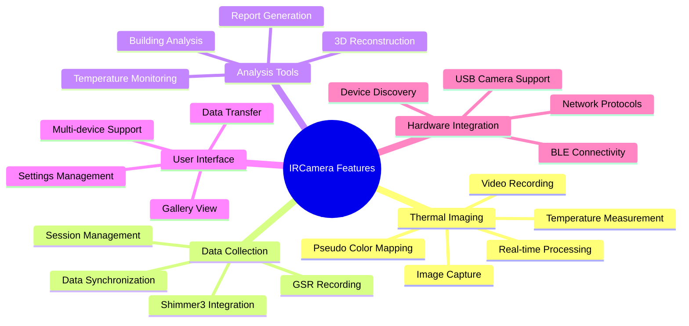
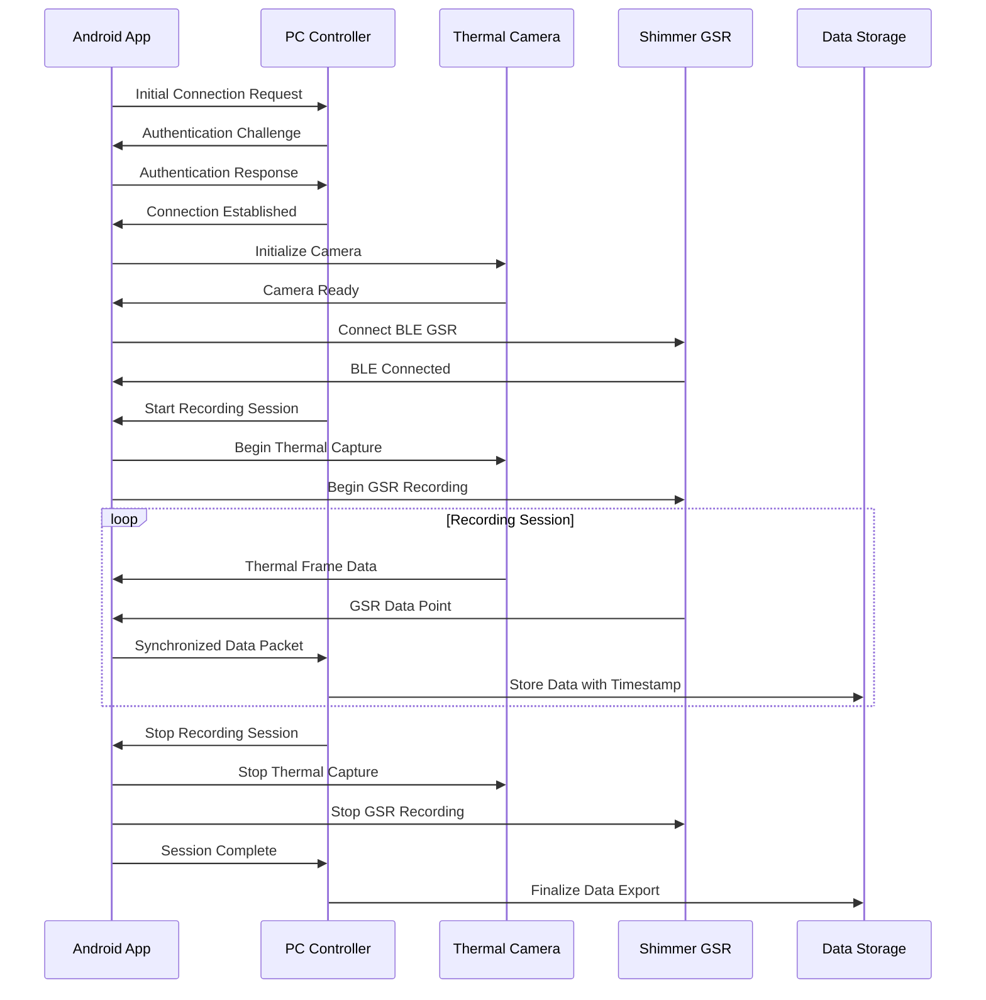
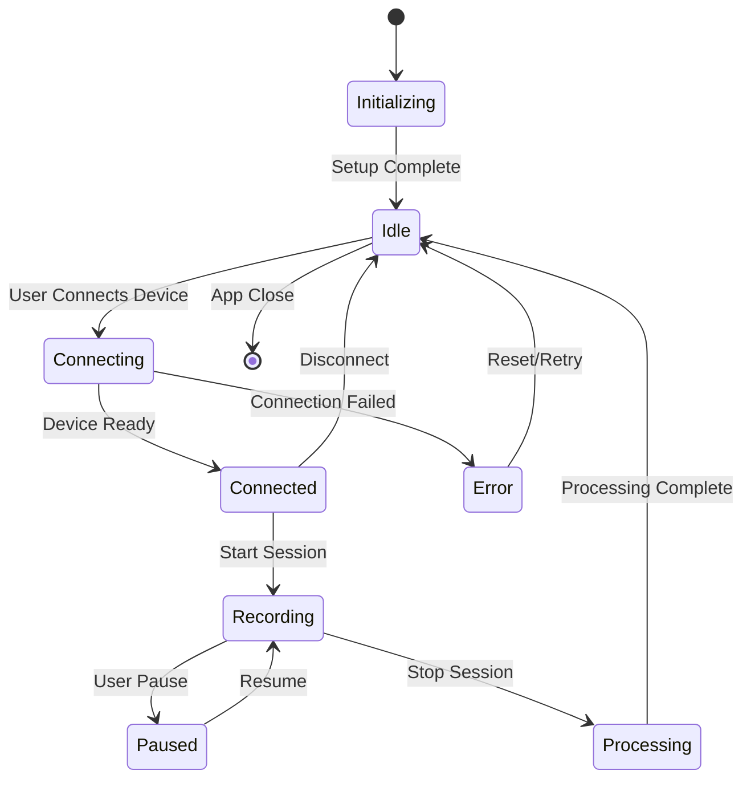
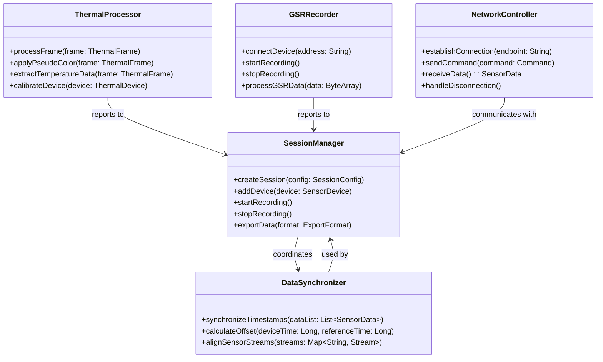
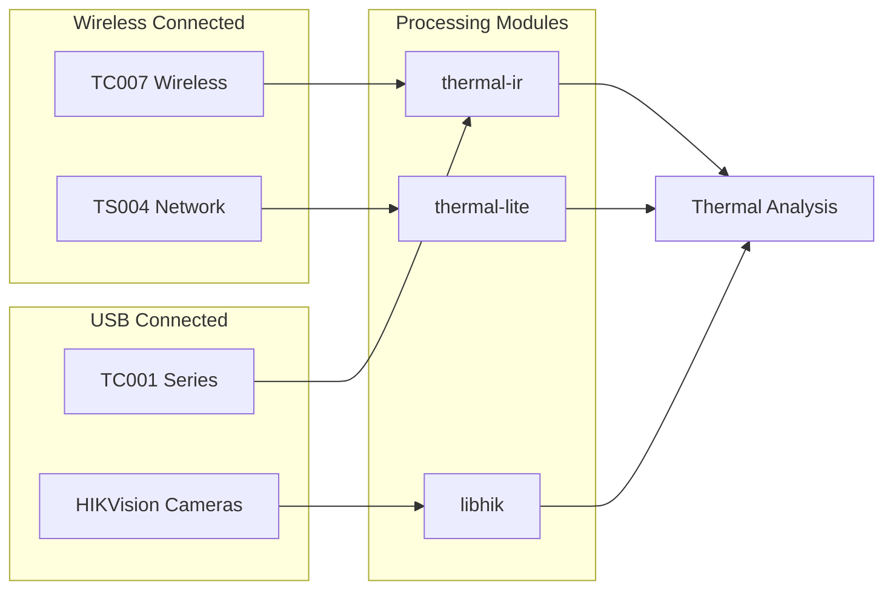

# IRCamera - Multi-Device Thermal Imaging Platform

[](https://developer.android.com/)
[](https://www.python.org/)
[](https://www.topdon.com/)

A comprehensive thermal imaging application platform supporting multiple thermal camera devices with advanced imaging capabilities, data recording, and cross-platform synchronization.

## 🎯 Overview

IRCamera is a modular thermal imaging platform that consists of:
- **Android Application**: Feature-rich mobile thermal imaging with multi-device support
- **PC Controller**: Python-based hub for advanced data processing and device coordination
- **Multi-Device Support**: TC001, TC007, TS004, HIKVision thermal cameras
- **GSR Integration**: Shimmer3 sensor support for physiological data collection

### Key Features

- **Multi-Device Thermal Imaging**: Support for various thermal camera models
- **Real-Time Processing**: Live thermal image processing and analysis
- **Data Synchronization**: Cross-platform data collection and synchronization
- **Advanced Analysis**: 3D thermal reconstruction, temperature monitoring, and reporting
- **Modular Architecture**: Component-based design for easy feature extension

## 🏗️ System Architecture

The IRCamera platform uses a modular, component-based architecture designed for flexibility and scalability:



## 📱 Component Architecture

### Android App Module Structure



### PC Controller Architecture



## 🔧 Feature Breakdown by Module

### Thermal Processing Modules

| Module | Purpose | Key Features |
|--------|---------|--------------|
| **thermal-ir** | Main thermal imaging | Real-time processing, temperature analysis, monitoring |
| **thermal-lite** | Lightweight thermal | Optimized for lower-end devices, basic thermal functions |
| **thermal** | Core thermal engine | Base thermal processing algorithms and utilities |
| **pseudo** | Pseudo coloring | False color mapping, thermal visualization enhancement |

### Data Collection & Analysis

| Module | Purpose | Key Features |
|--------|---------|--------------|
| **gsr-recording** | GSR data capture | Shimmer3 integration, physiological data recording |
| **house** | Building analysis | Thermal analysis for building inspection, energy auditing |
| **edit3d** | 3D reconstruction | 3D thermal model generation and editing |
| **transfer** | Data management | File transfer, synchronization, data export |

### User Interface & Controls

| Module | Purpose | Key Features |
|--------|---------|--------------|
| **user** | User management | Settings, preferences, user profiles |
| **CommonComponent** | Shared UI elements | Reusable components, common widgets |
| **RangeSeekBar** | Custom controls | Range selection, threshold setting |

### Core Libraries

| Library | Purpose | Key Features |
|---------|---------|--------------|
| **libapp** | Application core | Core app functionality, base classes |
| **libcom** | Communication | Network protocols, device communication |
| **libir** | IR processing | Thermal image processing algorithms |
| **libui** | UI framework | UI components and styling |
| **libhik** | HIKVision support | HIKVision camera integration |
| **libmatrix** | Matrix operations | Mathematical operations for image processing |
| **libmenu** | Menu system | Application menu and navigation |

## 🔄 Data Flow Architecture



## 🚀 Quick Start

### Prerequisites
- Android Studio 4.0+ with Kotlin support
- Python 3.8+ for PC Controller
- Supported thermal camera device
- Android device with API 21+

### Building the Android Application

```bash
# Clone the repository
git clone https://github.com/buccancs/IRCamera.git
cd IRCamera

# Build all modules
./gradlew clean build

# Build specific release APK
./gradlew :app:assembleRelease

# Install on connected device
adb install app/build/outputs/apk/release/app-release.apk
```

### Setting up PC Controller

```bash
# Navigate to PC controller directory
cd pc-controller

# Install Python dependencies
pip install -r requirements.txt

# Run the application
python src/main.py
```

### Basic Usage Flow

1. **Device Connection**: Connect thermal camera via USB or network
2. **App Launch**: Start Android application and select device type
3. **PC Sync** (Optional): Launch PC controller for advanced features
4. **Recording**: Begin thermal imaging session
5. **Data Export**: Export collected data for analysis

## 📱 Supported Devices & Features

### Thermal Camera Support

| Device | Module | Features | Notes |
|--------|---------|----------|-------|
| **TC001** | thermal-ir | Full thermal imaging, temperature analysis | Primary thermal device |
| **TC001 Plus** | thermal-ir | Enhanced processing, higher resolution | Advanced features |
| **TC001 Lite** | thermal-lite | Basic thermal imaging, optimized performance | Entry-level device |
| **TC007** | thermal-ir | Wireless thermal imaging, battery operation | Portable thermal camera |
| **TS004** | thermal | Network-connected thermal device | IP-based thermal imaging |
| **HIKVision** | libhik | Enterprise thermal cameras | Professional-grade devices |

### Android App Features by Module



## 🔧 Development Setup

### Project Structure Overview

```
IRCamera/
├── app/                    # Main Android application
├── pc-controller/          # Python PC application
├── component/              # Feature modules
│   ├── thermal-ir/         # Main thermal processing
│   ├── thermal-lite/       # Lightweight thermal
│   ├── gsr-recording/      # GSR data collection
│   ├── house/              # Building analysis
│   ├── edit3d/             # 3D editing tools
│   ├── transfer/           # Data transfer
│   ├── user/               # User management
│   ├── pseudo/             # Pseudo coloring
│   └── CommonComponent/    # Shared components
├── lib*/                   # Core libraries
│   ├── libapp/             # App framework
│   ├── libcom/             # Communication
│   ├── libir/              # IR processing
│   ├── libui/              # UI components
│   ├── libhik/             # HIKVision integration
│   ├── libmatrix/          # Matrix operations
│   └── libmenu/            # Menu system
├── BleModule/              # Bluetooth integration
└── RangeSeekBar/           # Custom UI control
```

### Key Technologies

- **Android Development**: Kotlin, MVVM Architecture, CameraX, Android Architecture Components
- **PC Controller**: Python 3.8+, GUI frameworks, data processing libraries
- **Communication**: Network protocols, BLE integration, device synchronization
- **Image Processing**: Thermal image algorithms, pseudo coloring, matrix operations
- **Hardware Integration**: Multiple thermal camera APIs, GSR sensor integration

### Adding New Components

1. **Create Module**: Add new module in `component/` directory
2. **Update Settings**: Add module to `settings.gradle.kts`
3. **Define Dependencies**: Configure `build.gradle.kts` for the module
4. **Implement Interface**: Follow existing patterns in similar modules
5. **Integration**: Wire module into main application

### Development Workflow

```bash
# 1. Setup development environment
./gradlew build

# 2. Run tests
./gradlew test

# 3. Build specific module
./gradlew :component:thermal-ir:build

# 4. Generate documentation
./gradlew dokka

# 5. Create release build
./gradlew assembleRelease
```

## 📊 Data Output Formats

### Thermal Data
```
thermal_session_YYYYMMDD_HHMMSS/
├── thermal_video.mp4       # Processed thermal video
├── raw_thermal/            # Raw thermal data frames
├── temperature_map.csv     # Temperature measurements
└── metadata.json          # Session configuration
```

### GSR Data (when using PC Controller)
```
gsr_session_YYYYMMDD_HHMMSS/
├── gsr_data.csv           # Time-series GSR measurements  
├── events.csv             # Synchronization events
├── raw_images/            # Synchronized image captures
└── session_info.json     # Recording metadata
```

## 🔄 Advanced System Diagrams

### Communication Sequence Diagram



### Component Lifecycle State Diagram



### Deployment Architecture

```mermaid
deployment
    node "Android Device" {
        component "IRCamera App" {
            [thermal-ir]
            [gsr-recording]
            [libir]
            [libcom]
        }
        database "Local Storage"
    }
    
    node "PC Controller" {
        component "Python Hub" {
            [Session Manager]
            [Data Aggregator]
            [GSR Ingestor]
        }
        database "Centralized Storage"
    }
    
    node "Thermal Hardware" {
        [TC001 Camera]
        [TC007 Camera]
        [TS004 Camera]
        [HIKVision Camera]
    }
    
    node "BLE Sensors" {
        [Shimmer3 GSR]
        [Custom Sensors]
    }
    
    [IRCamera App] --> [Python Hub]: TCP/IP Protocol
    [IRCamera App] --> [TC001 Camera]: USB/Wireless
    [IRCamera App] --> [Shimmer3 GSR]: BLE
    [Python Hub] --> [Centralized Storage]: File I/O
```

### Class Relationship Diagram



## 🔌 Hardware Integration

### Supported Thermal Cameras



### BLE Sensor Integration

The `BleModule` provides:
- Shimmer3 GSR sensor connectivity
- Real-time physiological data streaming
- Data synchronization with thermal capture
- Multi-sensor coordination

## 🧪 Testing

### Unit Tests
```bash
# Run all tests
./gradlew test

# Test specific module
./gradlew :component:thermal-ir:test

# Test with coverage
./gradlew testDebugUnitTestCoverage
```

### Integration Tests
```bash
# PC Controller tests
cd pc-controller
python -m pytest test_system_integration.py

# Comprehensive tests
python test_comprehensive.py
```

## 📚 Comprehensive Documentation

### 🚀 Getting Started
- **[Quick Start Guide](docs/QUICK_START.md)** - Essential setup and usage
- **[User Manual](docs/USER_MANUAL.md)** - Complete user documentation
- **[Troubleshooting](docs/TROUBLESHOOTING.md)** - Common issues and solutions

### 🏗️ Architecture & Development
- **[Developer Guide](docs/DEVELOPER_GUIDE.md)** - Development procedures and architecture  
- **[Architecture Guide](docs/ARCHITECTURE.md)** - Detailed system architecture
- **[Contributing Guide](docs/CONTRIBUTING.md)** - Contribution guidelines and standards

### 📖 Technical References
- **[Technical Specifications](docs/TECHNICAL_SPECIFICATIONS.md)** - Complete technical specifications for all components
- **[API Reference](docs/API_REFERENCE.md)** - Basic protocol and SDK documentation
- **[Advanced API Documentation](docs/ADVANCED_API_DOCUMENTATION.md)** - Comprehensive API with detailed examples

### 🧩 Component Documentation
- **[Thermal-IR Module](docs/modules/THERMAL_IR_MODULE.md)** - Primary thermal imaging component
- **[GSR Recording Module](docs/modules/GSR_RECORDING_MODULE.md)** - Shimmer3 GSR sensor integration
- **[LibIR Library](docs/modules/LIBIR_LIBRARY.md)** - Core thermal processing algorithms
- **[PC Controller](docs/modules/PC_CONTROLLER.md)** - Python-based central hub

### 📊 Additional Resources
- **[Performance Benchmarks](docs/PERFORMANCE_BENCHMARKS.md)** - System performance analysis
- **[Security Guidelines](docs/SECURITY_GUIDELINES.md)** - Security implementation guide
- **[Deployment Guide](docs/DEPLOYMENT_GUIDE.md)** - Production deployment instructions

## 🤝 Contributing

We welcome contributions to the IRCamera platform:

1. **Fork** the repository
2. **Create** a feature branch (`git checkout -b feature/thermal-enhancement`)
3. **Commit** your changes (`git commit -m 'Add thermal enhancement feature'`)
4. **Push** to the branch (`git push origin feature/thermal-enhancement`)
5. **Open** a Pull Request

### Contribution Guidelines

- Follow existing code style and patterns
- Add tests for new functionality
- Update documentation as needed
- Ensure all builds pass before submitting PR

See **[CONTRIBUTING.md](docs/CONTRIBUTING.md)** for detailed guidelines.

## 📄 License

This project is licensed under the MIT License - see the [LICENSE](LICENSE) file for details.

## 🙏 Acknowledgments

- **Topdon Technology** for thermal camera hardware and SDK support
- **HIKVision** for enterprise thermal camera integration
- **Shimmer Research** for GSR sensor integration and physiological sensing
- **Android Community** for CameraX and modern Android development patterns
- **Open Source Community** for various libraries and tools used in this project

---

**IRCamera** - Advanced Thermal Imaging Platform  
*Professional thermal imaging with multi-device support and advanced analysis capabilities*